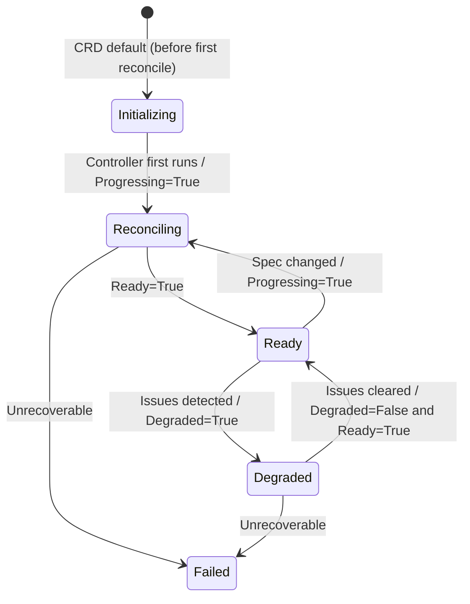

# Valkey status conditions

The `ValkeyCluster` and `ValkeyNode` custom resources use their `status` fields to provide detailed feedback about the current state of the Valkey cluster and its managed nodes. This document explains the different fields and conditions you can use to monitor and understand cluster and node health.

## Status fields

These top-level fields in `.status` provide a high-level, human-readable summary of the cluster's state.

- **`state`**: A single word that summarizes the overall condition of the cluster. The possible values are:
  - `Initializing`: The cluster is being created for the first time.
  - `Reconciling`: The operator is actively working to bring the cluster to its desired state (e.g., scaling, updating, or recovering).
  - `Ready`: The cluster is healthy, fully functional, and serving traffic.
  - `Degraded`: The cluster is at least partially functional but is in an unhealthy state (e.g., a primary is down, not all replicas are available).
  - `Failed`: The operator has encountered a persistent error and cannot reach the desired state.

- **`reason`**: A machine-readable, `CamelCase` string that provides a brief explanation for the current `state`.

- **`message`**: A detailed, human-readable message explaining the current state.

- **`shards`**: The number of shards currently detected in the Valkey cluster.

- **`readyShards`**: The number of shards that are fully healthy, meaning they have a primary and the desired number of replicas.

---

## Conditions array (`status.conditions[]`)

`conditions[]` follows the standard Kubernetes `metav1.Condition` format:

- **type**: condition name (e.g., `Ready`, `Progressing`)
- **status**: `True`, `False`, or `Unknown`
- **reason**: short machine-readable code (stable)
- **message**: human-readable explanation
- **lastTransitionTime**: time when the condition last changed
- **observedGeneration**: the resource generation the controller observed when setting the condition

---

## Condition types

### Standard conditions

#### `Ready`
Indicates whether the cluster is fully functional and serving traffic.

| Status | Meaning |
|---|---|
| `True` | All shards exist with correct number of nodes, **cluster is healthy**, and topology is complete. |
| `False` | Initial creation, topology changes needed, missing shards/replicas, or infrastructure errors. |

Common reasons when `Ready=False`:
- `ServiceError` – failed to create/update headless service
- `ConfigMapError` – failed to create/update configuration
- `UsersACLError` – failed to reconcile ACL users/secrets
- `SystemUsersACLError` – failed to reconcile system/internal ACL users
- `ValkeyNodeError` – failed to create/update ValkeyNode CRs
- `ValkeyNodeListError` – failed to list ValkeyNodes
- `PodDisruptionBudgetError` – failed to create/update/delete the PodDisruptionBudget
- `Reconciling` – controller is making changes
- `UpdatingNodes` – rolling update of ValkeyNode CRs in progress
- `MissingShards` – waiting for all shards to be created
- `MissingReplicas` – waiting for all replicas to be created
- `PodUnschedulable` – Kubernetes cannot schedule one or more Valkey pods

Common reasons when `Ready=True`:
- `ClusterHealthy` – Cluster is healthy

#### `Progressing`
Indicates whether the cluster is being created, updated, or scaled.

| Status | Meaning |
|---|---|
| `True` | Reconciliation in progress (creating resources, adding nodes, etc.). |
| `False` | Cluster matches desired state and is stable. |

Common reasons:
- `Initializing` – initial cluster creation
- `Reconciling` – general reconciliation in progress
- `AddingNodes` – adding nodes to the cluster
- `UpdatingNodes` – rolling update of ValkeyNode CRs in progress
- `RebalancingSlots` – rebalancing hash slots across primaries (scale-out and scale-in)
- `ReconcileComplete` – reconciliation finished (typically with `status=False`)

#### `Degraded`
Indicates whether the cluster is impaired but may still be partially functional.

| Status | Meaning |
|---|---|
| `True` | Cluster has issues but may still serve traffic. |
| `False` (or absent) | Cluster is not degraded. |

Common reasons:
- `NodeAddFailed` – failed to add a node to the cluster
- `RebalanceFailed` – slot rebalancing failed (scale-out or scale-in)
- `PodUnschedulable` – Kubernetes scheduler cannot place one or more Valkey pods, for example because strict topology spread constraints cannot be satisfied

---

### Valkey-specific conditions

#### `ClusterFormed`
Indicates whether all nodes have joined the cluster and meet the desired shard/replica layout.

| Status | Meaning |
|---|---|
| `True` | All shards and replicas are present and joined. |
| `False` | Pending nodes, missing shards, or missing replicas. |

Typical reasons:
- `ClusterFormed` – Cluster is formed
- `MissingShards` – waiting for shards
- `MissingReplicas` – waiting for replicas

#### `SlotsAssigned`
Indicates whether all **16384** hash slots are assigned to primaries.

| Status | Meaning |
|---|---|
| `True` | All slots are assigned. |
| `False` (or absent) | Some slots remain unassigned. |

Common reasons:
- `AllSlotsAssigned` – all 16384 slots are assigned
- `SlotsUnassigned` – waiting for slots to be assigned

---

### ValkeyNode conditions

`ValkeyNode` resources are internal resources created by the operator for each Valkey cluster member. Their conditions are useful when debugging why a cluster is still reconciling, especially when persistence is enabled.

#### `Ready`
Indicates whether the ValkeyNode pod is ready and the backing workload has completed rollout.

| Status | Meaning |
|---|---|
| `True` | The pod is running, ready, and the workload is rolled out to the current spec. |
| `False` | The pod is missing, not ready, rolling out, or blocked by an infrastructure dependency such as a PVC. |

Common reasons when `Ready=False`:
- `PodNotReady` – pod is missing, not ready, or the workload has not finished rolling out.
- `PersistentVolumeClaimPending` – persistence is enabled and the managed PVC is missing or not yet bound.

Common reasons when `Ready=True`:
- `PodRunning` – pod is running, ready, and the workload is rolled out.

#### `PersistentVolumeClaimReady`
Indicates whether the managed PVC for a persistent ValkeyNode exists and is bound.

| Status | Meaning |
|---|---|
| `True` | The managed PVC is `Bound` and can be mounted by the pod. |
| `False` | The managed PVC does not exist yet or is not bound. |

Common reasons:
- `PersistentVolumeClaimPending` – PVC is missing or still pending.
- `PersistentVolumeClaimBound` – PVC is bound.

#### `PersistentVolumeClaimSizeReady`
Indicates whether the managed PVC has satisfied the requested storage size.

| Status | Meaning |
|---|---|
| `True` | The PVC capacity is at least the requested `spec.persistence.size`. |
| `False` | The PVC is not bound, expansion is still running, expansion is pending, or expansion cannot be satisfied. |

Common reasons:
- `PersistentVolumeClaimSizeSatisfied` – PVC capacity satisfies the requested size.
- `PersistentVolumeClaimResizePending` – PVC is waiting for binding, controller expansion, or node-side filesystem resize.
- `PersistentVolumeClaimResizeInProgress` – PVC expansion is actively in progress.
- `PersistentVolumeClaimResizeInfeasible` – PVC expansion failed or cannot be completed without operator action.

#### `LiveConfigApplied`
Indicates whether the live-settable subset of `spec.config` has been successfully applied to the running Valkey process via `CONFIG SET`.

This condition is only set when the node is ready and there are allowlisted config keys present in `spec.config`. If `spec.config` contains no allowlisted keys the condition is absent, which is treated the same as `True` by the cluster controller.

| Status | Meaning |
|---|---|
| `True` | All allowlisted config keys were applied successfully in the last reconcile. |
| `False` | `CONFIG SET` failed; the running config may not match `spec.config`. The cluster controller will not advance past this node until the condition is `True`. |

Common reasons when `LiveConfigApplied=False`:
- `ApplyFailed` – `CONFIG SET` returned an error (e.g. a permissions error or an invalid value). The message field contains the exact error.

Common reasons when `LiveConfigApplied=True`:
- `Applied` – Live config applied successfully.

> **Note:** A `False` condition blocks one-at-a-time progress in the cluster controller (the same way `Ready=False` does during a rolling update). The node controller retries with exponential backoff and emits a `LiveConfigApplyFailed` warning event on each failure. The condition clears in either of two ways: once `CONFIG SET` succeeds it transitions to `True`, or if the offending key is removed from `spec.config` (leaving no allowlisted keys) the condition is removed and reverts to absent. Either way the cluster advances.

Example commands:

```bash
# View internal nodes and their readiness
kubectl get valkeynodes

# Inspect PVC-related conditions for a node
kubectl get valkeynode my-cluster-0-0 -o jsonpath='{.status.conditions[?(@.type=="PersistentVolumeClaimReady")]}'
kubectl get valkeynode my-cluster-0-0 -o jsonpath='{.status.conditions[?(@.type=="PersistentVolumeClaimSizeReady")]}'
```

---

## State transitions

The high-level `state` is derived from conditions (priority order):

1. `Degraded=True` → `state=Degraded`
2. `Ready=True` → `state=Ready`
3. `Progressing=True` → `state=Reconciling`
4. `Ready=False` with no other stronger signal → `state=Failed`

> **Note:** `Initializing` is the CRD default for `status.state` and is visible briefly on a brand-new cluster before the controller first updates the status to `Reconciling`.

### Visual flow



---

## Kubernetes Events

Events complement the status conditions described above. While `conditions` represent the current state of the cluster (e.g., `Ready=True`), events provide a historical timeline of actions and changes (e.g., "Created deployment 1 of 6"). Use conditions for monitoring the current state and events for understanding what happened and troubleshooting issues.

### Event types

Events are categorized as:
- **Normal**: Successful operations and informational messages
- **Warning**: Failures, errors, or degraded conditions

### Infrastructure events

These events are emitted during the creation and management of Kubernetes resources.

| Event Type | Type | Description |
|---|---|---|
| `ServiceCreated` | Normal | Headless Service is created |
| `ServiceUpdateFailed` | Warning | Service update fails |
| `ConfigMapCreated` | Normal | ConfigMap with Valkey configuration is created |
| `ConfigMapUpdateFailed` | Warning | ConfigMap creation/update fails |
| `ValkeyNodeCreated` | Normal | ValkeyNode CR is created for a shard/replica position |
| `ValkeyNodeUpdated` | Normal | ValkeyNode CR spec is updated (rolling update) |
| `ValkeyNodeFailed` | Warning | Failed to create or update a ValkeyNode CR |
| `PodDisruptionBudgetCreated` | Normal | PodDisruptionBudget is created |
| `PodDisruptionBudgetUpdated` | Normal | PodDisruptionBudget is updated |
| `PodDisruptionBudgetDeleted` | Normal | PodDisruptionBudget is deleted (policy set to Disabled) |

### Cluster topology events

These events track the formation and changes to the Valkey cluster topology.

| Event Type | Type | Description |
|---|---|---|
| `ClusterMeetBatch` | Normal | Isolated nodes introduced to the cluster in batch |
| `ClusterMeetFailed` | Warning | CLUSTER MEET command fails |
| `PrimariesCreated` | Normal | Slot assignment completed for new primary nodes (batch) |
| `PrimaryCreated` | Normal | Primary node created with slot assignment |
| `SlotAssignmentFailed` | Warning | Slot assignment to primary fails |
| `ReplicasAttached` | Normal | Replica nodes attached to their primaries (batch) |
| `ReplicaCreated` | Normal | Replica created for a primary |
| `ReplicaCreationFailed` | Warning | Replica creation fails |

### Slot rebalancing events

These events are emitted during scale-out slot rebalancing.

| Event Type | Type | Description |
|---|---|---|
| `SlotsRebalancing` | Normal | Slot migration is in progress between shards |
| `SlotsRebalancePending` | Normal | Waiting for a shard to learn its migration target before moving slots |
| `SlotRebalanceFailed` | Warning | Slot rebalancing failed |

### Scale-in events

These events are emitted during scale-in operations.

| Event Type | Type | Description |
|---|---|---|
| `SlotsDraining` | Normal | Slots are being migrated away from a draining shard |
| `ValkeyNodeDeleted` | Normal | ValkeyNode for a drained shard is deleted |
| `DrainFailed` | Warning | Failed to drain slots from excess shards |

### Proactive failover events

These events are emitted during proactive primary failovers (e.g., when a primary pod is being replaced due to a rolling update).

| Event Type | Type | Description |
|---|---|---|
| `FailoverInitiated` | Normal | A `CLUSTER FAILOVER` command was sent to a replica to take over as primary |
| `FailoverFailed` | Warning | The `CLUSTER FAILOVER` command returned an error |
| `FailoverTimeout` | Warning | The failover did not complete within the allowed timeout |
| `FailoverCompleted` | Normal | The replica has successfully become the new primary |

### Maintenance events

These events are emitted during cluster maintenance operations.

| Event Type | Type | Description |
|---|---|---|
| `StaleNodeForgotten` | Normal | Stale node is forgotten from the cluster |
| `NodeForgetFailed` | Warning | Forgetting a node fails |

### Status events

These events provide high-level status information about the cluster.

| Event Type | Type | Description |
|---|---|---|
| `WaitingForShards` | Normal | Waiting for shards to be created |
| `WaitingForReplicas` | Normal | Waiting for replicas in a shard |
| `ClusterReady` | Normal | Cluster is fully ready and healthy |

### Live config events

These events are emitted during live configuration application on ValkeyNode resources.

| Event Type | Type | Description |
|---|---|---|
| `LiveConfigApplyFailed` | Warning | `CONFIG SET` failed on a node; the `LiveConfigApplied` condition is set to `False` and the cluster controller will not advance past this node until it recovers |

### Users/ACL events

These events are emitted during ACL user management.

| Event Type | Type | Description |
|---|---|---|
| `InternalSecretsCreated` | Normal | Internal ACL secret created |
| `InternalSecretsUpdated` | Normal | Internal ACL secret synchronized |
| `InternalSecretsCreationFailed` | Warning | Failed to create or take ownership of internal ACL secret |
| `InternalSecretsUpdateFailed` | Warning | Failed to update internal ACL secret |

### Viewing events

Events can be viewed using standard `kubectl` commands.

```bash
# View all events in namespace
kubectl get events -n default

# Watch events in real-time
kubectl get events -n default --watch

# View events for a specific cluster
kubectl get events --field-selector involvedObject.name=valkeycluster-sample

# View events sorted by time
kubectl get events -n default --sort-by='.lastTimestamp'

# View events in describe output
kubectl describe valkeycluster valkeycluster-sample
```

---

## Monitoring status

### Quick status check

```bash
kubectl get valkeycluster
# or
kubectl get vkc
```

### Detailed status

```bash
# Describe including conditions
kubectl describe valkeycluster my-cluster

# Full YAML
kubectl get valkeycluster my-cluster -o yaml

# Query a specific condition
kubectl get valkeycluster my-cluster -o jsonpath='{.status.conditions[?(@.type=="Ready")]}'
```

---

## Example status outputs

### Healthy cluster

```yaml
status:
  state: Ready
  reason: ClusterHealthy
  message: Cluster is healthy
  shards: 3
  readyShards: 3
  conditions:
  - type: Ready
    status: "True"
    reason: ClusterHealthy
    message: Cluster is healthy
    lastTransitionTime: "2025-12-19T10:00:00Z"
    observedGeneration: 1
  - type: Progressing
    status: "False"
    reason: ReconcileComplete
    message: No changes needed
    lastTransitionTime: "2025-12-19T10:00:00Z"
    observedGeneration: 1
  - type: ClusterFormed
    status: "True"
    reason: TopologyComplete
    message: All nodes joined cluster
    lastTransitionTime: "2025-12-19T09:59:45Z"
    observedGeneration: 1
  - type: SlotsAssigned
    status: "True"
    reason: AllSlotsAssigned
    message: All slots assigned
    lastTransitionTime: "2025-12-19T09:59:45Z"
    observedGeneration: 1
```

### Initializing cluster

```yaml
status:
  state: Initializing
  reason: Reconciling
  message: Creating shards
  shards: 0
  readyShards: 0
  conditions:
  - type: Ready
    status: "False"
    reason: MissingShards
    message: Waiting for all shards to be created
    lastTransitionTime: "2025-12-19T10:00:00Z"
    observedGeneration: 1
  - type: Progressing
    status: "True"
    reason: Reconciling
    message: Creating shards
    lastTransitionTime: "2025-12-19T10:00:00Z"
    observedGeneration: 1
  - type: ClusterFormed
    status: "False"
    reason: MissingShards
    message: Waiting for shards
    lastTransitionTime: "2025-12-19T10:00:00Z"
    observedGeneration: 1
```

**Recent events** (from `kubectl describe`):
```text
Events:
  Type    Reason             Age   From                      Message
  ----    ------             ----  ----                      -------
  Normal  ServiceCreated     30s   valkeycluster-controller  Created headless Service
  Normal  ConfigMapCreated   30s   valkeycluster-controller  Created ConfigMap with configuration
  Normal  ValkeyNodeCreated  25s   valkeycluster-controller  Created ValkeyNode for shard 0 node 0
  Normal  WaitingForShards   20s   valkeycluster-controller  0 of 3 shards exist
```

### Degraded cluster

```yaml
status:
  state: Degraded
  reason: NodeAddFailed
  message: "Failed to add node: connection timeout"
  shards: 2
  readyShards: 2
  conditions:
  - type: Ready
    status: "False"
    reason: Reconciling
    message: Cluster is Reconciling
    lastTransitionTime: "2025-12-19T10:00:00Z"
    observedGeneration: 1
  - type: Progressing
    status: "True"
    reason: AddingNodes
    message: Adding nodes to cluster
    lastTransitionTime: "2025-12-19T10:00:00Z"
    observedGeneration: 1
  - type: Degraded
    status: "True"
    reason: NodeAddFailed
    message: "Failed to add node: connection timeout"
    lastTransitionTime: "2025-12-19T10:00:05Z"
    observedGeneration: 1
 - type: SlotsAssigned
   status: "False"
   reason: SlotsUnassigned
   message: Assigning slots to nodes
   lastTransitionTime: "2025-12-19T10:00:05Z"
   observedGeneration: 1
```
**Recent events** (from `kubectl describe`):
```text
Events:
  Type     Reason               Age   From                      Message
  ----     ------               ----  ----                      -------
  Normal   ServiceCreated       30s   valkeycluster-controller  Created headless Service
  Normal   ConfigMapCreated     30s   valkeycluster-controller  Created ConfigMap with configuration
  Normal   ValkeyNodeCreated    25s   valkeycluster-controller  Created ValkeyNode for shard 0 node 0
  Normal   ClusterMeetBatch     15m   valkeycluster-controller  Introduced 6 isolated node(s) to the cluster
  Warning  ClusterMeetFailed    14m   valkeycluster-controller  CLUSTER MEET 10.244.0.10 -> 10.244.0.11 failed: connection timeout
  Warning  ReplicaCreationFailed 14m  valkeycluster-controller  Failed to create replica: connection timeout
```

---

## Sample: `kubectl describe valkeycluster valkeycluster-sample`

Below is an example of `kubectl describe` output for a healthy 3-shard cluster with 1 replica per shard. (`k` is a common `kubectl` alias.)

```text
k describe valkeycluster valkeycluster-sample
Name:         valkeycluster-sample
Namespace:    default
Labels:       <none>
Annotations:  <none>
API Version:  valkey.io/v1alpha1
Kind:         ValkeyCluster
Metadata:
  Creation Timestamp:  2025-12-19T06:07:10Z
  Generation:          1
  Resource Version:    108933
  UID:                 7b60e0f4-2842-4929-bc94-3fa3cfb1dfa5
Spec:
  Replicas:  1
  Shards:    3
Status:
  Conditions:
    Last Transition Time:  2025-12-19T06:07:21Z
    Message:               Cluster is healthy
    Observed Generation:   1
    Reason:                ClusterHealthy
    Status:                True
    Type:                  Ready
    Last Transition Time:  2025-12-19T06:07:21Z
    Message:               No changes needed
    Observed Generation:   1
    Reason:                ReconcileComplete
    Status:                False
    Type:                  Progressing
    Last Transition Time:  2025-12-19T06:07:21Z
    Message:               All nodes joined cluster
	Observed Generation:   1
    Reason:                TopologyComplete
    Status:                True
    Type:                  ClusterFormed
    Last Transition Time:  2025-12-19T06:07:21Z
    Message:               All slots assigned
    Observed Generation:   1
    Reason:                AllSlotsAssigned
    Status:                True
    Type:                  SlotsAssigned
  Message:                 Cluster is healthy
  Ready Shards:            3
  Reason:                  ClusterHealthy
  Shards:                  3
  State:                   Ready
Events:
  Type    Reason             Age   From                      Message
  ----    ------             ----  ----                      -------
  Normal  ServiceCreated     15m   valkeycluster-controller  Created headless Service
  Normal  ConfigMapCreated   15m   valkeycluster-controller  Created ConfigMap with configuration
  Normal  ValkeyNodeCreated  15m   valkeycluster-controller  Created ValkeyNode for shard 0 node 0
  Normal  ValkeyNodeCreated  15m   valkeycluster-controller  Created ValkeyNode for shard 0 node 1
  Normal  ValkeyNodeCreated  15m   valkeycluster-controller  Created ValkeyNode for shard 1 node 0
  Normal  ValkeyNodeCreated  15m   valkeycluster-controller  Created ValkeyNode for shard 1 node 1
  Normal  ValkeyNodeCreated  15m   valkeycluster-controller  Created ValkeyNode for shard 2 node 0
  Normal  ValkeyNodeCreated  15m   valkeycluster-controller  Created ValkeyNode for shard 2 node 1
  Normal  ClusterMeetBatch   14m   valkeycluster-controller  Introduced 6 isolated node(s) to the cluster
  Normal  PrimaryCreated     14m   valkeycluster-controller  Created primary 10.244.0.10 with slots 0-5460
  Normal  PrimaryCreated     14m   valkeycluster-controller  Created primary 10.244.0.11 with slots 5461-10922
  Normal  PrimaryCreated     14m   valkeycluster-controller  Created primary 10.244.0.12 with slots 10923-16383
  Normal  PrimariesCreated   14m   valkeycluster-controller  Assigned slots to 3 new primary node(s)
  Normal  ReplicaCreated     14m   valkeycluster-controller  Created replica for primary abc123 (shard 0)
  Normal  ReplicaCreated     14m   valkeycluster-controller  Created replica for primary def456 (shard 1)
  Normal  ReplicaCreated     14m   valkeycluster-controller  Created replica for primary ghi789 (shard 2)
  Normal  ReplicasAttached   14m   valkeycluster-controller  Attached 3 replica node(s)
  Normal  ClusterReady       14m   valkeycluster-controller  Cluster ready with 3 shards and 1 replicas
```

### How to read it

- **Summary**
  - `State: Ready` + `Reason: ClusterHealthy` + `Message: Cluster is healthy` → cluster is serving normally.
  - `Shards: 3` and `Ready Shards: 3` → all shards are formed and healthy.

- **Conditions**
  - `Progressing=False (ReconcileComplete)` → controller is not actively changing anything.
  - `Ready=True (ClusterHealthy)` → cluster is fully functional.
  - `ClusterFormed=True (TopologyComplete)` → nodes have joined and match the requested topology (`spec.shards=3`, `spec.replicas=1`).
  - `SlotsAssigned=True (AllSlotsAssigned)` → all 16384 hash slots are assigned.

- **Observed Generation**
  - `Observed Generation: 1` on all conditions means status reflects **Generation 1** of the spec (i.e., the latest desired configuration at the time).

- **Events**
  - Events show the historical timeline of what the operator did to reach the current state.
  - All events are `Normal` type, indicating successful operations.
  - Events are retained for ~1 hour by default (configurable in Kubernetes).
  - Events are rate-limited by Kubernetes to prevent flooding (e.g., identical events are aggregated).

---

## Sample: `kubectl get valkeycluster -A -o wide -w` (watch)

The watch output below shows how `state` and `reason` evolve during creation:

```text
k get valkeycluster -A -o wide -w
NAMESPACE   NAME                   STATE          REASON           READYSHARDS   AGE
default     valkeycluster-sample   Initializing   Reconciling      0             0s
default     valkeycluster-sample   Reconciling    Reconciling      0             0s
default     valkeycluster-sample   Reconciling    AddingNodes      0             2s
default     valkeycluster-sample   Reconciling    AddingNodes      0             2s
default     valkeycluster-sample   Reconciling    AddingNodes      0             4s
default     valkeycluster-sample   Reconciling    AddingNodes      0             6s
default     valkeycluster-sample   Reconciling    AddingNodes      1             11s
default     valkeycluster-sample   Reconciling    AddingNodes      2             11s
default     valkeycluster-sample   Ready          ClusterHealthy   3             11s
```

After a spec update (e.g. image upgrade), the rolling update path produces:

```text
k get valkeycluster -A -o wide -w
NAMESPACE   NAME                   STATE          REASON           READYSHARDS   AGE
default     valkeycluster-sample   Reconciling    UpdatingNodes    3             5m
default     valkeycluster-sample   Reconciling    UpdatingNodes    3             5m
default     valkeycluster-sample   Ready          ClusterHealthy   3             6m
```

### What this indicates

- **Initializing → Reconciling**
  - `Initializing` is the **initial state** for a new cluster before reconciliation begins.
  - Transition to `Reconciling` means reconciliation has begun.

- **Reconciling (AddingNodes)**
  - `Reason=AddingNodes` indicates the controller is actively joining pods to the Valkey cluster.
  - `READYSHARDS` increases (0 → 1 → 2 → 3) as shards become fully healthy.

- **Reconciling (UpdatingNodes)**
  - `Reason=UpdatingNodes` indicates a rolling update of ValkeyNode CRs is in progress (one node at a time, replicas before primaries).

- **Ready (ClusterHealthy)**
  - Once `READYSHARDS` reaches the desired shard count and the cluster is healthy, the summary switches to `Ready / ClusterHealthy`.
