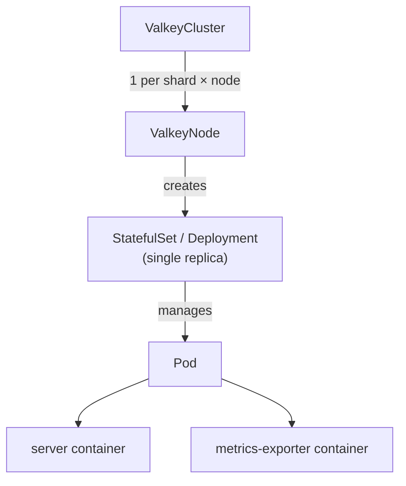

# ValkeyCluster

`ValkeyCluster` deploys Valkey in [Cluster mode](https://valkey.io/topics/cluster-tutorial/), handling:

- Topology scheduling
- Slot allocation
- Failovers
- Rolling updates
- ACLs

## Features

- [Config](#config)
- [Containers](#containers)
- [Metrics](#metrics)
- [Persistence](#persistence)
- [Pod disruption budget](#pod-disruption-budget)
- [Private image registries](#private-image-registries)
- [Scheduling](#scheduling)
- [TLS](#tls)
- [Users](#users)
- [Workload type](#workload-type)

### Config

```yaml
config:
  io-threads: 4
  maxmemory-policy: noeviction
```

Use `config` to pass [Valkey configuration](https://valkey.io/topics/valkey.conf/) to all nodes in the cluster.

Listed below are configurations can be applied live without rolling pods. We are adopting configs that can be applied live on a case-by-case basis. For any requests please [raise an issue](https://github.com/valkey-io/valkey-operator/issues/new).

```
maxclients
maxmemory         # There are no safeguards, ensure you do not exceed your container capacity
maxmemory-policy
```

#### Constraints

- Cluster management settings owned by the operator cannot be overwritten

#### Future plans

- Operator validates configs before they are applied to the server
  - https://github.com/valkey-io/valkey-operator/issues/141#issuecomment-4269559003

### Containers

```yaml
containers:
  - name: server
    env:
      - name: MY_VAR
        value: "example"
  - name: my-sidecar
    image: busybox:latest
    command: ["sh", "-c", "sleep infinity"]
```

`containers` patches the pod's container list using strategic merge patch. Containers named `server` or `metrics-exporter` are merged by name; anything else is appended as a sidecar.

### Metrics

```yaml
exporter:
  enabled: true   # default
  image: oliver006/redis_exporter:v1.80.0
  resources:
    requests:
      memory: "64Mi"
      cpu: "50m"
```

Each pod runs a `metrics-exporter` sidecar by default, exposing Prometheus metrics on port `9121`. To disable it:

```yaml
exporter:
  enabled: false
```

### Persistence

```yaml
persistence:
  size: 10Gi
  storageClassName: gp3
  reclaimPolicy: Retain
```

When `persistence` is set, the operator manages a PVC for each ValkeyNode. With the [save config option](https://valkey.io/topics/persistence/), memory state survives pod rolls and [partial resyncs](https://valkey.io/topics/replication/) are possible.

`Retain` keeps the PVC when a ValkeyNode is deleted; `Delete` removes it.

#### Constraints

- Only supported with `workloadType: StatefulSet`
- Cannot be added or removed after creation
- Size can only grow
- `storageClassName` is immutable

#### Future plans

- Live volume expansion
- Automated volume expansion

### Pod disruption budget

```yaml
podDisruptionBudget: Managed  # default
```

The operator creates a `PodDisruptionBudget` with `maxUnavailable: 1` selecting all pods in the cluster. Set to `Disabled` when the PDB is managed externally or is not required.

| Value | Behaviour |
|---|---|
| `Managed` | Operator creates and owns the PDB |
| `Disabled` | Operator deletes the PDB if it exists and does not recreate it |

### Private image registries

```yaml
image: registry.example.com/valkey/valkey:9.0.0
imagePullSecrets:
  - name: registrycredential
```

`imagePullSecrets` is a list of `Secret` references (in the cluster's namespace) used to pull images from private registries. It is applied at the pod level, so a single list covers every image in the pod - the Valkey server, the metrics exporter sidecar, and any additional containers. It is optional and has no default; omit it when the nodes already authenticate to the registry.

### Scheduling

```yaml
tolerations:
  - key: "dedicated"
    operator: "Equal"
    value: "valkey"
    effect: "NoSchedule"
nodeSelector:
  kubernetes.io/arch: amd64
affinity:
  podAntiAffinity:
    requiredDuringSchedulingIgnoredDuringExecution:
      - labelSelector:
          matchLabels:
            app.kubernetes.io/name: valkey
        topologyKey: kubernetes.io/hostname
```

`tolerations`, `nodeSelector`, and `affinity` are passed through to every pod in the cluster.

#### Topology spread constraints

```yaml
topologySpreadConstraints:
  - maxSkew: 1
    topologyKey: kubernetes.io/hostname
    whenUnsatisfiable: DoNotSchedule
```

`topologySpreadConstraints` uses Kubernetes' native pod topology spread constraints and applies them to every Valkey pod in the cluster.

By default, the operator does not add any topology spread constraints. If `topologySpreadConstraints` is omitted or empty, pods are scheduled normally using the other scheduling fields such as `nodeSelector`, `affinity`, `tolerations`, and resource requests.

For `ValkeyCluster`, when a topology spread constraint is configured, the operator makes it shard-aware. It scopes the constraint to the current cluster and shard, so pods from the same shard, for example a primary and its replica, are spread across the configured topology domain.

Each constraint must include:

| Field | Meaning |
|---|---|
| `maxSkew` | Maximum allowed difference in matching pod count between topology domains. `1` means Kubernetes keeps the matching pods as evenly spread as possible. |
| `topologyKey` | Node label used as the spread domain. Use `kubernetes.io/hostname` for worker-node spreading, or labels such as `topology.kubernetes.io/zone` for zone spreading. |
| `whenUnsatisfiable` | What Kubernetes should do when the constraint cannot be satisfied. |

`whenUnsatisfiable` supports:

| Value | Behaviour | Impact |
|---|---|---|
| `DoNotSchedule` | Hard rule. Kubernetes will not schedule the pod if placement would violate the constraint. | Stronger HA placement, but pods may remain `Pending` when there are not enough eligible nodes or topology domains. The operator reports `PodUnschedulable` on the ValkeyCluster. |
| `ScheduleAnyway` | Soft rule. Kubernetes prefers satisfying the constraint, but can still schedule the pod if it cannot. | Better scheduling availability in constrained clusters, but pods from the same shard may still land in the same topology domain. |

Example strict node-level spreading:

```yaml
topologySpreadConstraints:
  - maxSkew: 1
    topologyKey: kubernetes.io/hostname
    whenUnsatisfiable: DoNotSchedule
```

This tries to keep pods from the same shard on different worker nodes. If the cluster does not have enough eligible worker nodes, affected pods stay `Pending`.

Example preferred node-level spreading:

```yaml
topologySpreadConstraints:
  - maxSkew: 1
    topologyKey: kubernetes.io/hostname
    whenUnsatisfiable: ScheduleAnyway
```

This still prefers spreading pods from the same shard across worker nodes, but allows scheduling to continue if the constraint cannot be satisfied.

### TLS

```yaml
tls:
  certificate:
    secretName: valkey-tls
```

`tls` enables TLS for all cluster communication. The Secret must contain:

| Key | Description |
|---|---|
| `ca.crt` | Certificate authority |
| `tls.crt` | Server certificate (or chain) |
| `tls.key` | Private key for the certificate |

### Users

```yaml
users:
  - name: alice
    passwordSecret:
      name: my-users-secret
      keys: [alicepw]
    commands:
      allow: ["@read", "@write", "@connection"]
      deny: ["@admin", "@dangerous"]
    keys:
      readWrite: ["app:*"]
      readOnly: ["shared:*"]
    channels:
      patterns: ["notifications:*"]
  - name: bob
    nopass: true
    permissions: "+@all ~* &*"
```

`users` defines per-user [ACL rules](https://valkey.io/topics/acl/) distributed to every node via a Secret mounted into each pod.

- `passwordSecret` — one or more password keys from a Secret (multiple keys supported for rotation)
- `commands` — command categories (`@read`, `@write`, `@admin`, etc.), individual commands, and subcommands to allow or deny
- `keys` — key patterns by access type: `readWrite`, `readOnly`, `writeOnly`
- `channels` — pub/sub channel patterns
- `permissions` — raw ACL string appended after any generated rules

#### Constraints

- Usernames cannot start with `_` (reserved for operator-managed system users)

### Workload type

```yaml
workloadType: StatefulSet  # default
```

`workloadType` controls whether ValkeyNodes use a `StatefulSet` or a `Deployment`. Use `Deployment` for cache-only clusters where you don't need persistent storage or stable pod identity.

#### Constraints

- Immutable after creation
- `persistence` requires `workloadType: StatefulSet`

## Architecture

`ValkeyCluster` creates a `ValkeyNode` for each shard/replica position. The `ValkeyNode` controller owns the underlying `StatefulSet` or `Deployment` and its single pod.



`ValkeyNode` is an internal CRD — do not create or modify ValkeyNodes directly. All configuration goes through `ValkeyCluster`. See [ValkeyNode design](./valkeynode-design.md) for why this abstraction exists.

For status conditions and events, see [status-conditions.md](./status-conditions.md).
